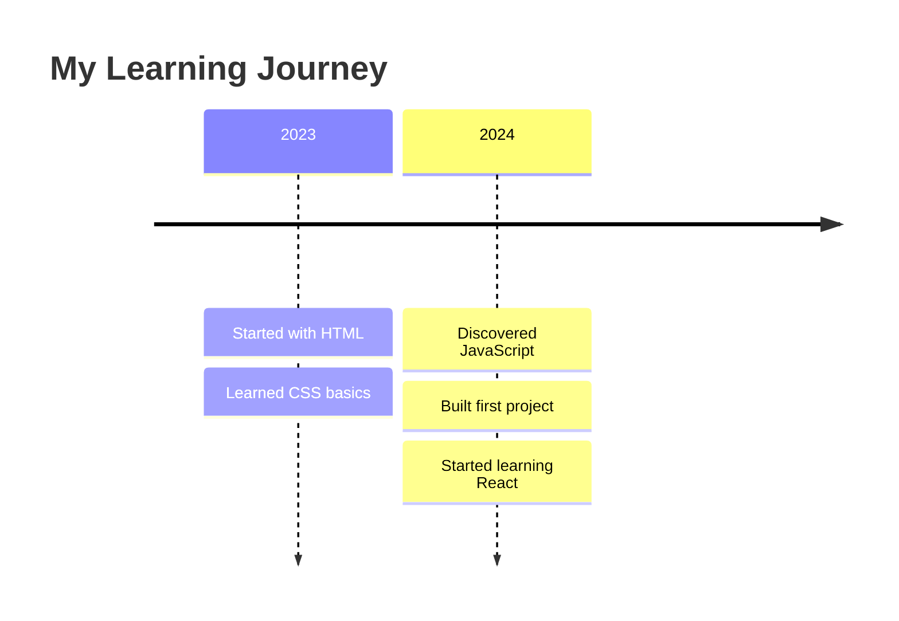

# The Complete Quartz 4 Power User Guide 🌱

*A comprehensive guide to customizing your Quartz site with layouts, graphs, tags, timelines, CSS, comments, analytics, and advanced features*

## Table of Contents
1. [Layout & UI Architecture](#layout--ui-architecture)
2. [Graph View Configuration](#graph-view-configuration)
3. [Tags & Tag Cloud Implementation](#tags--tag-cloud-implementation)
4. [Timeline & Recent Notes](#timeline--recent-notes)
5. [Custom YAML Frontmatter](#custom-yaml-frontmatter)
6. [CSS & JavaScript Customization](#css--javascript-customization)
7. [Comments Integration](#comments-integration)
8. [Analytics Setup](#analytics-setup)
9. [Advanced Features](#advanced-features)
10. [Custom Components & Plugins](#custom-components--plugins)
11. [Ready-to-Use Configurations](#ready-to-use-configurations)

---

## Layout & UI Architecture

### Understanding Quartz Layout Structure

Quartz 4 uses a component-based layout system defined in `quartz.layout.ts`. The layout is divided into specific regions:

```typescript
export interface FullPageLayout {
  head: QuartzComponent        // HTML <head> metadata
  header: QuartzComponent[]    // Horizontal header bar
  beforeBody: QuartzComponent[] // Before main content
  pageBody: QuartzComponent    // Main content area
  afterBody: QuartzComponent[] // After main content
  left: QuartzComponent[]      // Left sidebar
  right: QuartzComponent[]     // Right sidebar
}
```

### Essential Layout Components

**Navigation & Structure:**
- `Component.Explorer()` - File tree navigation
- `Component.Breadcrumbs()` - Path navigation
- `Component.TableOfContents()` - Page TOC
- `Component.Search()` - Full-text search
- `Component.Backlinks()` - Incoming links

**Content Discovery:**
- `Component.RecentNotes()` - Recent/modified notes
- `Component.Graph()` - Interactive graph view
- `Component.TagList()` - Tag display
- `Component.ContentMeta()` - Page metadata

**UI Enhancement:**
- `Component.Darkmode()` - Theme toggle
- `Component.ReaderMode()` - Distraction-free reading
- `Component.DesktopOnly()` / `Component.MobileOnly()` - Responsive wrappers

### Sample Layout Configuration

```typescript
// quartz.layout.ts
import { PageLayout, SharedLayout } from "./quartz/cfg"
import * as Component from "./quartz/components"

export const sharedPageComponents: SharedLayout = {
  head: Component.Head(),
  header: [
    Component.Search(),
    Component.Darkmode(),
  ],
  beforeBody: [
    Component.Breadcrumbs(),
    Component.TableOfContents(),
  ],
  afterBody: [
    Component.Comments({
      provider: 'giscus',
      options: {
        repo: 'your-username/your-repo',
        repoId: 'your-repo-id',
        category: 'Announcements',
        categoryId: 'your-category-id',
      }
    }),
  ],
  left: [
    Component.DesktopOnly(Component.Explorer({
      title: "Documentation",
      folderDefaultState: "open",
      folderClickBehavior: "link",
      useSavedState: true
    })),
  ],
  right: [
    Component.RecentNotes({
      title: "Recently Updated",
      limit: 5,
      showTags: false
    }),
  ],
}

// quartz.config.ts - Documentation theming
configuration: {
  pageTitle: "Documentation Hub",
  enableSPA: true,
  enablePopovers: true,
  analytics: { provider: 'goatcounter', websiteId: 'your-site' },
  theme: {
    typography: {
      header: "IBM Plex Sans",
      body: "IBM Plex Sans",
      code: "IBM Plex Mono"
    },
    colors: {
      lightMode: {
        secondary: "#0066cc",
        tertiary: "#0080ff",
        highlight: "rgba(0, 102, 204, 0.1)"
      }
    }
  },
  defaultDateType: "modified"
}
```

---

## Performance Optimization Tips

### Bundle Size Optimization

```typescript
// Only include components you need
right: [
  // Instead of including everything, be selective
  Component.Graph(), // Only if you need graphs
  Component.RecentNotes({ limit: 5 }), // Limit items
]

// Remove unused transformers/emitters
plugins: {
  transformers: [
    // Remove plugins you don't use
    // Plugin.CrawlLinks(), // Remove if no link analysis needed
    Plugin.FrontMatter(),
    Plugin.CreatedModifiedDate(),
    // ... only what you need
  ]
}
```

### SEO & Social Media Optimization

```typescript
// quartz.config.ts
configuration: {
  baseUrl: "yourdomain.com", // Critical for proper URLs
  pageTitle: "Your Site Name",
}

// In plugins
emitters: [
  Plugin.Static(),
  Plugin.ComponentResources(),
  Plugin.ContentPage(),
  Plugin.FolderPage(),
  Plugin.TagPage(),
  Plugin.ContentIndex(),
  Plugin.Assets(),
  Plugin.CNAME({
    domain: "yourdomain.com" // For custom domains
  }),
  Plugin.Sitemap(),
  Plugin.RSS({
    includeEmptyFiles: false,
  }),
  Plugin.CustomOgImages({
    // Generate custom OG images
    colorScheme: "light",
    font: {
      name: "Inter",
      size: 72
    }
  })
]
```

### Frontmatter for SEO

```yaml
---
title: "Ultimate Guide to Web Development"
description: "Learn web development from scratch with our comprehensive guide covering HTML, CSS, JavaScript, and modern frameworks."
socialDescription: "🚀 Master web development with our complete guide! Perfect for beginners and experienced developers."
socialImage: "/images/web-dev-guide-social.png"
tags: [web-development, tutorial, javascript, html, css]
published: 2024-02-20
modified: 2024-02-25
author: "Your Name"
---
```

---

## Advanced Customization Tricks

### Custom Date Formatting

```typescript
// quartz/components/ContentMeta.tsx customization
const formatDate = (d: Date, locale: string = "en-US"): string => {
  return d.toLocaleDateString(locale, {
    year: "numeric",
    month: "long", 
    day: "numeric",
    weekday: "long" // Add weekday
  })
}
```

### Dynamic Theme Colors

```scss
// quartz/styles/custom.scss
:root {
  --accent-hue: 220;
  --accent-sat: 70%;
  --accent-light: 50%;
  
  --secondary: hsl(var(--accent-hue), var(--accent-sat), var(--accent-light));
  --tertiary: hsl(var(--accent-hue), calc(var(--accent-sat) - 20%), calc(var(--accent-light) + 15%));
}

// Allow users to customize theme
.theme-blue { --accent-hue: 220; }
.theme-green { --accent-hue: 120; }
.theme-purple { --accent-hue: 270; }
.theme-orange { --accent-hue: 30; }
```

### Custom Shortcodes/Components

```typescript
// Create custom markdown extensions
// quartz/plugins/transformers/customShortcodes.ts
import { QuartzTransformerPlugin } from "../types"
import remarkDirective from 'remark-directive'
import { visit } from 'unist-util-visit'

export const CustomShortcodes: QuartzTransformerPlugin = () => {
  return {
    name: "CustomShortcodes",
    markdownPlugins() {
      return [
        remarkDirective,
        () => {
          return (tree, file) => {
            visit(tree, 'containerDirective', (node) => {
              if (node.name === 'youtube') {
                const videoId = node.attributes?.id
                if (videoId) {
                  node.type = 'html'
                  node.value = `
                    <div class="youtube-embed">
                      <iframe 
                        width="560" 
                        height="315" 
                        src="https://www.youtube.com/embed/${videoId}"
                        frameborder="0" 
                        allowfullscreen>
                      </iframe>
                    </div>
                  `
                }
              }
            })
          }
        }
      ]
    }
  }
}
```

Usage in markdown:
```markdown
:::youtube{id="dQw4w9WgXcQ"}
:::
```

### Reading Progress Indicator

```typescript
// quartz/components/scripts/readingProgress.inline.ts
document.addEventListener('nav', () => {
  const content = document.querySelector('.page-content')
  if (!content) return
  
  let progressBar = document.querySelector('.reading-progress')
  if (!progressBar) {
    progressBar = document.createElement('div')
    progressBar.className = 'reading-progress'
    document.body.appendChild(progressBar)
  }
  
  const updateProgress = () => {
    const contentHeight = content.scrollHeight - window.innerHeight
    const scrolled = window.scrollY
    const progress = Math.min(scrolled / contentHeight, 1)
    progressBar.style.transform = `scaleX(${progress})`
  }
  
  window.addEventListener('scroll', updateProgress)
  updateProgress()
})
```

```scss
// Corresponding CSS
.reading-progress {
  position: fixed;
  top: 0;
  left: 0;
  width: 100%;
  height: 3px;
  background: var(--secondary);
  transform: scaleX(0);
  transform-origin: left;
  transition: transform 0.1s ease-out;
  z-index: 1000;
}
```

---

## Troubleshooting Common Issues

### Graph Not Showing
- Ensure `ContentIndex` emitter is enabled in plugins
- Check that pages have internal links `[[Page Name]]`
- Verify graph component is in layout

### Search Not Working
- ContentIndex emitter must be enabled
- Check for JavaScript errors in browser console
- Ensure search component is properly added to layout

### Comments Not Loading
- Verify repository is public and has discussions enabled
- Check giscus configuration values
- Ensure correct category ID and repository ID

### Slow Build Times
- Remove unused plugins and transformers
- Use `.quartzignore` to exclude large files
- Consider using `ignorePatterns` in config

### Styling Not Applied
- Check CSS file paths and imports
- Ensure custom.scss is being processed
- Verify CSS class names match frontmatter

---

## Migration & Maintenance

### From Quartz 3 to 4
```bash
# Backup your existing site
cp -r content content-backup

# Update content structure if needed
# Frontmatter changes:
# - `tag: single` becomes `tags: [single]`
# - Date formats are more flexible
# - New fields available (cssclasses, etc.)
```

### Regular Maintenance Tasks

1. **Update Dependencies:**
```bash
npm update
npx quartz update
```

2. **Content Cleanup:**
- Review and update old frontmatter
- Check for broken internal links
- Update tag hierarchies

3. **Performance Monitoring:**
- Check bundle sizes
- Monitor page load times
- Review analytics data

4. **Backup Strategy:**
- Regular git commits
- Export content separately
- Document custom configurations

---

## Conclusion

This guide covers the complete spectrum of Quartz 4 customization possibilities. Remember that Quartz's strength lies in its modularity - you can start simple and gradually add complexity as needed.

**Quick Start Checklist:**
- [ ] Configure basic layout in `quartz.layout.ts`
- [ ] Set up theming in `quartz.config.ts`
- [ ] Add analytics provider
- [ ] Configure comments if needed
- [ ] Customize CSS in `custom.scss`
- [ ] Test responsive design
- [ ] Set up proper SEO metadata
- [ ] Configure deployment

**Advanced Features to Explore:**
- [ ] Custom components
- [ ] Advanced graph configurations  
- [ ] Custom plugins
- [ ] Performance optimizations
- [ ] SEO enhancements

For the most up-to-date information, always refer to the [official Quartz documentation](https://quartz.jzhao.xyz/) as the project continues to evolve rapidly.

---

## Showcase: Excellent Quartz Sites for Inspiration

Based on research from the official Quartz showcase and digital garden communities, here are outstanding examples of Quartz implementations across different categories:

### 🎓 Academic & Research Sites

**[Stanford CME 302 Numerical Linear Algebra](https://ericdarve.github.io/NLA/)**
- **Focus**: Academic course materials and mathematical concepts
- **Features**: Comprehensive mathematical notation, structured course layout, extensive cross-linking
- **Standout Elements**: Clean academic styling, proper LaTeX rendering, organized hierarchical content

**[Socratica Toolbox](https://toolbox.socratica.info/)**
- **Focus**: Educational tools and methodologies
- **Features**: Tool-focused organization, practical guides, interconnected learning resources
- **Standout Elements**: Resource-centric design, clear categorization, practical application focus

**[The Quantum Well](https://publish.obsidian.md/myquantumwell/)**
- **Focus**: Quantum mechanics and mathematical physics
- **Features**: Complex mathematical concepts, visual diagrams, interconnected theory networks
- **Standout Elements**: Scientific rigor, mathematical notation excellence, conceptual linking

### 💻 Technology & Development Sites

**[Jacky Zhao's Garden](https://jzhao.xyz/)**
- **Creator**: Quartz's original developer
- **Focus**: Technology research, open-source projects, academic work
- **Features**: Personal research showcase, project documentation, technical writing
- **Standout Elements**: Creator's personal implementation, cutting-edge features, research focus

**[Everything I Know - Nikita Voloboev](https://wiki.nikiv.dev/)**
- **Focus**: Comprehensive knowledge base covering 100+ tech topics
- **Features**: Extensive categorization, tool recommendations, learning resources
- **Standout Elements**: Massive scale (17k+ pages), systematic organization, practical focus

**[Jethro's Braindump](https://braindump.jethro.dev/)**
- **Focus**: Software development, machine learning, research notes
- **Features**: Technical depth, research paper summaries, code examples
- **Standout Elements**: Academic rigor meets practical development, extensive cross-referencing

**[Chris Biscardi's Garden](https://www.christopherbiscardi.com/garden)**
- **Focus**: Modern web development (Rust, GraphQL, Serverless)
- **Features**: Technical tutorials, code snippets, development insights
- **Standout Elements**: Cutting-edge tech focus, practical examples, developer-friendly design

### 🧠 Personal Knowledge Management & Learning

**[Andy's Working Notes](https://notes.andymatuschak.org/)**
- **Focus**: Learning science, note-taking methodology, research
- **Features**: Evergreen notes system, spaced repetition concepts, learning theory
- **Standout Elements**: Foundational PKM concepts, research-backed methods, influential thinking

**[Mental Nodes - Anne-Laure Le Cunff](https://www.mentalnodes.com/)**
- **Focus**: Networked thinking, creativity, metacognition
- **Features**: Bi-directional linking, creativity frameworks, learning methodologies
- **Standout Elements**: Beautiful design, practical creativity tools, well-structured content

**[Eleanor's Notes](https://publish.obsidian.md/eleanorkonik/)**
- **Focus**: History, science, worldbuilding, productivity
- **Features**: Multi-topic integration, fantasy worldbuilding, academic research
- **Standout Elements**: Creative + academic blend, organized chaos, genuine working notes

**[Digital Zen Garden - Binny VA](https://notes.binnyva.com/)**
- **Focus**: Behavior, cognition, psychology, productivity
- **Features**: Mental models, behavioral insights, self-improvement frameworks
- **Standout Elements**: Psychological depth, practical applications, clear mental models

### 🎨 Creative & Personal Sites

**[Eilleen's Everything Notebook](https://quartz.eilleeenz.com/)**
- **Focus**: Personal thoughts, creative projects, life reflections
- **Features**: Personal journaling, creative work showcase, life documentation
- **Standout Elements**: Personal authenticity, creative presentation, intimate sharing

**[The Pond - TurnTrout](https://turntrout.com/)**
- **Focus**: AI alignment, rationality, personal reflections
- **Features**: Technical AI content, personal essays, rationality discussions
- **Standout Elements**: Unique voice, technical depth, personal integration

**[Mister Chad's Creative Hub](https://mister-chad.com/)**
- **Focus**: Graphic design, creativity, teaching methodologies
- **Features**: Design resources, creative process documentation, teaching materials
- **Standout Elements**: Visual design excellence, creative process transparency, educational focus

### 📚 Specialized Knowledge Sites

**[Morrowind Modding Wiki](https://morrowind-modding.github.io/)**
- **Focus**: Game modding community knowledge base
- **Features**: Community-driven content, technical modding guides, collaborative editing
- **Standout Elements**: Community collaboration, specialized domain expertise, technical depth

**[A Pattern Language - Christopher Alexander](https://patternlanguage.cc/)**
- **Focus**: Architecture and design patterns
- **Features**: Pattern-based organization, architectural theory, design principles
- **Standout Elements**: Systematic pattern documentation, visual design integration, theoretical depth

**[Gatekeeper Wiki](https://www.gatekeeper.wiki/)**
- **Focus**: Specialized domain knowledge (context-dependent)
- **Features**: Wiki-style organization, comprehensive coverage, community contributions
- **Standout Elements**: Collaborative knowledge building, systematic organization, domain expertise

### 🏢 Professional & Business Sites

**[Data Engineering Vault](https://vault.ssp.sh/)**
- **Focus**: Data engineering, analytics, technical infrastructure
- **Features**: Technical guides, best practices, tool comparisons
- **Standout Elements**: Professional depth, practical applications, industry focus

**[Brandon Boswell's Garden](https://brandonkboswell.com/)**
- **Focus**: Professional development, business insights, personal growth
- **Features**: Career advice, business strategy, professional networking
- **Standout Elements**: Professional presentation, career-focused content, networking emphasis

### 🔬 Research & Academic Excellence

**[Gwern.net](https://www.gwern.net/)**
- **Focus**: Psychology, statistics, technology research
- **Features**: Extensive research papers, statistical analyses, experimental design
- **Standout Elements**: Research rigor, statistical depth, long-form analysis, influential work

**[Rob's Hypertext Notebook](https://robhaisfield.com/)**
- **Focus**: Product strategy, technology adoption, user research
- **Features**: Hypertext navigation, product insights, strategic thinking
- **Standout Elements**: Strategic depth, hypertext mastery, product focus

### 💡 Innovation & Unique Implementations

**[The Compendium - Alex Komoroske](https://thecompendium.cards/)**
- **Focus**: Complex problem-solving, organizational insights, strategic thinking
- **Features**: Card-based organization, interconnected insights, evolving content
- **Standout Elements**: Unique card interface, living document concept, strategic insights

**[wilde at heart](https://wilde-at-heart.garden/)**
- **Focus**: Aesthetics, embodiment, digital culture, classification systems
- **Features**: Artistic presentation, cultural critique, aesthetic theory
- **Standout Elements**: Artistic design, cultural depth, aesthetic excellence

## What Makes These Sites Exceptional

### Design Excellence
- **Clean, readable typography** with carefully chosen font combinations
- **Consistent color schemes** that support readability and brand identity
- **Responsive layouts** that work seamlessly across devices
- **Intuitive navigation** that helps users discover content naturally

### Content Strategy
- **Clear value proposition** - visitors immediately understand the site's purpose
- **Organized information architecture** with logical hierarchies and cross-connections
- **Regular updates** showing active maintenance and fresh content
- **Personal voice** that makes the content authentic and engaging

### Technical Implementation
- **Fast loading times** through optimized builds and efficient hosting
- **Effective search functionality** that helps users find relevant content
- **Smart use of backlinks** creating a web of interconnected knowledge
- **Mobile optimization** ensuring excellent experience on all devices

### Community Features
- **Comments integration** for reader engagement and discussion
- **Social sharing** capabilities for broader reach
- **RSS feeds** for subscribers to follow updates
- **Contact information** for direct communication

## Key Lessons for Your Implementation

### Start Simple, Iterate
Most successful sites began with basic layouts and evolved over time. Focus on:
1. **Content first** - great content in a simple layout beats poor content in a complex design
2. **User experience** - ensure visitors can easily navigate and find value
3. **Personal authenticity** - let your unique voice and perspective shine through

### Technical Best Practices
- **Enable SPA routing** for smooth navigation (like most showcase sites)
- **Implement search** - essential for content discovery in knowledge sites
- **Use graph views** thoughtfully - they're powerful but can be overwhelming if not curated
- **Optimize for mobile** - many successful sites prioritize mobile experience

### Content Organization
- **Develop a tagging strategy** that reflects your thinking and helps others navigate
- **Create entry points** - clear starting pages for different types of visitors
- **Build connection networks** - use internal linking to create knowledge webs
- **Maintain consistency** in formatting, naming, and organizational principles

---

*These examples demonstrate Quartz's versatility across academic research, technical documentation, creative expression, and personal knowledge management. Each site showcases different aspects of what's possible with thoughtful customization and content strategy.*

*Happy building! 🌱*DesktopOnly(Component.Explorer()),
  ],
  right: [
    Component.Graph({
      localGraph: { depth: 1, showTags: true, drag: true, zoom: true },
      globalGraph: { depth: -1, enableRadial: true, showTags: true }
    }),
    Component.RecentNotes({
      title: "Recent Updates",
      limit: 10,
      showTags: true,
    }),
  ],
}
```

---

## Graph View Configuration

The Graph View is one of Quartz's most powerful features, showing relationships between your notes.

### Basic Graph Setup

```typescript
Component.Graph({
  localGraph: {
    depth: 2,           // How many hops from current page
    scale: 1.1,         // Node scaling factor
    repelForce: 0.5,    // Node repulsion strength
    centerForce: 0.3,   // Centering force
    linkDistance: 30,   // Link length
    fontSize: 0.6,      // Label font size
    opacityScale: 1,    // Node opacity scaling
    showTags: true,     // Show tag nodes
    removeTags: [],     // Tags to hide: ["draft", "private"]
    drag: true,         // Enable dragging
    zoom: true,         // Enable zoom
  },
  globalGraph: {
    depth: -1,          // Show all connections (-1 = infinite)
    scale: 0.9,
    repelForce: 0.5,
    centerForce: 0.3,
    linkDistance: 30,
    fontSize: 0.6,
    opacityScale: 1,
    showTags: true,
    removeTags: ["draft", "private"],
    enableRadial: true, // Radial layout for global view
    enableDrag: true,
    enableZoom: true,
    enableHover: true,
    enableLegend: true,
  }
})
```

### Graph Customization Options

**Visual Enhancements:**
- `enableRadial: true` - Use radial layout for better visualization
- `removeTags: ["internal", "draft"]` - Hide specific tag nodes
- `showTags: false` - Completely hide tag nodes
- Custom CSS in `quartz/components/styles/graph.scss`

**Performance Tuning:**
- `depth: 1` for local, `depth: 2` for more connections
- Adjust `repelForce` and `centerForce` for node positioning
- Use `removeTags` to reduce visual clutter

---

## Tags & Tag Cloud Implementation

Quartz provides built-in tag functionality with several enhancement options.

### Built-in Tag Features

**Automatic Tag Pages:**
- Global `/tags` index page
- Individual tag pages at `/tags/[tag-name]`
- Hierarchical tags support (e.g., `project/web-dev`)

**Tag Configuration:**

```typescript
// In quartz.config.ts plugins section
emitters: [
  Plugin.TagPage({
    sort: (f1, f2) => {
      return new Date(f2.dates?.modified ?? f2.dates?.created ?? new Date()).getTime() 
           - new Date(f1.dates?.modified ?? f1.dates?.created ?? new Date()).getTime()
    }
  })
]
```

### Custom Tag Cloud Component

Since Quartz doesn't have a built-in tag cloud, here's how to create one:

```typescript
// quartz/components/TagCloud.tsx
import { QuartzComponent, QuartzComponentConstructor, QuartzComponentProps } from "./types"
import { GlobalConfiguration } from "../cfg"

interface TagCloudOptions {
  maxTags?: number
  minFontSize?: number
  maxFontSize?: number
}

export default ((opts?: TagCloudOptions) => {
  const TagCloud: QuartzComponent = ({ 
    fileData, 
    allFiles, 
    cfg 
  }: QuartzComponentProps) => {
    const tags: Record<string, number> = {}
    
    // Count tag frequencies
    allFiles.forEach(file => {
      file.frontmatter?.tags?.forEach((tag: string) => {
        tags[tag] = (tags[tag] || 0) + 1
      })
    })
    
    const maxTags = opts?.maxTags ?? 50
    const minSize = opts?.minFontSize ?? 0.8
    const maxSize = opts?.maxFontSize ?? 2.0
    
    const sortedTags = Object.entries(tags)
      .sort(([,a], [,b]) => b - a)
      .slice(0, maxTags)
    
    if (sortedTags.length === 0) return null
    
    const maxCount = Math.max(...sortedTags.map(([, count]) => count))
    const minCount = Math.min(...sortedTags.map(([, count]) => count))
    
    return (
      <div class="tag-cloud">
        <h3>Tags</h3>
        <div class="tag-cloud-container">
          {sortedTags.map(([tag, count]) => {
            const size = minSize + ((count - minCount) / (maxCount - minCount)) * (maxSize - minSize)
            return (
              <a 
                href={`/tags/${tag}`}
                class="tag-cloud-item"
                style={`font-size: ${size}rem;`}
              >
                {tag}
              </a>
            )
          })}
        </div>
      </div>
    )
  }
  
  return TagCloud
}) satisfies QuartzComponentConstructor
```

**Add corresponding CSS:**

```scss
// quartz/components/styles/tagcloud.scss
.tag-cloud {
  margin: 1rem 0;
  
  .tag-cloud-container {
    display: flex;
    flex-wrap: wrap;
    gap: 0.5rem;
    margin-top: 0.5rem;
  }
  
  .tag-cloud-item {
    text-decoration: none;
    padding: 0.2rem 0.5rem;
    border-radius: 0.25rem;
    background: var(--lightgray);
    color: var(--secondary);
    transition: all 0.2s ease;
    
    &:hover {
      background: var(--secondary);
      color: var(--light);
      transform: scale(1.05);
    }
  }
}
```

---

## Timeline & Recent Notes

### Recent Notes Component

```typescript
Component.RecentNotes({
  title: "Recently Updated",
  limit: 15,
  showTags: true,
  linkToMore: "tags/blog", // Optional "see more" link
  filter: (f) => f.slug !== "index", // Custom filtering
  sort: (f1, f2) => { // Custom sorting
    return new Date(f2.dates?.modified ?? f2.dates?.created ?? new Date()).getTime() 
         - new Date(f1.dates?.modified ?? f1.dates?.created ?? new Date()).getTime()
  }
})
```

### Date Configuration

```typescript
// quartz.config.ts
configuration: {
  defaultDateType: "modified", // or "created" or "published"
  // ... other config
}

// In plugins section
transformers: [
  Plugin.CreatedModifiedDate({
    priority: ["git", "filesystem", "frontmatter"], // Date source priority
  })
]
```

### Timeline Frontmatter

```markdown
---
title: "My Article"
created: 2024-01-15
modified: 2024-02-20
published: 2024-01-20
tags: [article, timeline]
---
```

### Visual Timeline with Mermaid

```markdown

```

---

## Custom YAML Frontmatter

Quartz supports extensive frontmatter customization:

### Complete Frontmatter Reference

```yaml
---
# Basic metadata
title: "Page Title"
description: "Page description for SEO and previews"
draft: false
publish: true

# Dates (multiple formats supported)
created: 2024-01-15
modified: 2024-02-20T15:30:00
published: 2024-01-20 10:00:00

# Navigation & URLs
permalink: "/custom-url/"
aliases: ["old-url", "another-alias"]

# Content organization
tags: [web-dev, tutorial, javascript]
# Alternative formats:
# tag: single-tag
# tags: 
#   - web-dev
#   - tutorial

# Display & behavior
enableToc: true
cssclasses: [wide-content, highlight-links]
cssclass: special-page  # Alternative to cssclasses

# Language & i18n
lang: en-US

# Social & SEO
socialDescription: "Custom social media description"
socialImage: "/images/social-preview.png"
image: "/images/cover.jpg"        # Alternative to socialImage
cover: "/images/article-cover.jpg" # Alternative to image

# Comments
comments: true  # false to disable on specific pages

# Custom fields (for your own use)
author: "Your Name"
category: "Tutorial"
difficulty: "Beginner"
readingTime: 15
featured: true
---
```

### Advanced Frontmatter Usage

**Custom CSS Classes:**

```yaml
---
cssclasses: [two-column, large-images, dark-theme]
---
```

```scss
// quartz/styles/custom.scss
.page.two-column .page-content {
  columns: 2;
  column-gap: 2rem;
}

.page.large-images img {
  max-width: 120%;
  margin-left: -10%;
}

.page.dark-theme {
  background: var(--dark);
  color: var(--light);
}
```

---

## CSS & JavaScript Customization

### Global Styling Configuration

```typescript
// quartz.config.ts
configuration: {
  theme: {
    cdnCaching: false, // Set to false for self-hosted fonts
    typography: {
      header: "Inter",
      body: "Inter",
      code: "JetBrains Mono"
    },
    colors: {
      lightMode: {
        light: "#faf8f8",
        lightgray: "#e5e5e5", 
        gray: "#b8b8b8",
        darkgray: "#4e4e4e",
        dark: "#2b2b2b",
        secondary: "#284b63",
        tertiary: "#84a59d",
        highlight: "rgba(143, 159, 169, 0.15)",
        textHighlight: "#fff23688"
      },
      darkMode: {
        light: "#161618",
        lightgray: "#393639",
        gray: "#646464",
        darkgray: "#d4d4d4",
        dark: "#ebebec",
        secondary: "#7b97aa",
        tertiary: "#84a59d",
        highlight: "rgba(143, 159, 169, 0.15)",
        textHighlight: "#b3aa0288"
      }
    }
  }
}
```

### Custom CSS

```scss
// quartz/styles/custom.scss

// Custom variables
:root {
  --custom-accent: #ff6b6b;
  --custom-radius: 8px;
}

// Page-specific styles
.page-title {
  background: linear-gradient(135deg, var(--secondary), var(--tertiary));
  -webkit-background-clip: text;
  -webkit-text-fill-color: transparent;
  background-clip: text;
}

// Enhanced link styles
a {
  position: relative;
  transition: all 0.2s ease;
  
  &:hover {
    transform: translateY(-1px);
  }
  
  &:not(.internal) {
    &::after {
      content: "↗";
      font-size: 0.8em;
      opacity: 0.6;
      margin-left: 0.2em;
    }
  }
}

// Custom callout styles
.callout {
  border-radius: var(--custom-radius);
  border-left: 4px solid var(--custom-accent);
  
  &.callout-tip {
    background: linear-gradient(135deg, #e8f5e8, #f0f8f0);
    border-color: #22c55e;
  }
}

// Responsive design
@media (max-width: 768px) {
  .page-content {
    padding: 1rem;
  }
  
  .sidebar {
    display: none;
  }
}

// Dark mode specific
[saved-theme="dark"] {
  .custom-highlight {
    background: rgba(255, 255, 255, 0.1);
  }
}

// Print styles
@media print {
  .sidebar, .graph, .comments {
    display: none !important;
  }
}
```

### Custom JavaScript

```typescript
// quartz/components/scripts/custom.inline.ts
document.addEventListener('nav', () => {
  // Runs after each page navigation in SPA mode
  console.log('Page navigated')
  
  // Add reading time estimation
  const content = document.querySelector('.page-content')
  if (content) {
    const wordCount = content.innerText.split(/\s+/).length
    const readingTime = Math.ceil(wordCount / 200)
    
    const meta = document.querySelector('.content-meta')
    if (meta && !meta.querySelector('.reading-time')) {
      const timeElement = document.createElement('span')
      timeElement.className = 'reading-time'
      timeElement.innerHTML = ` • ${readingTime} min read`
      meta.appendChild(timeElement)
    }
  }
})

// Add keyboard shortcuts
document.addEventListener('keydown', (e) => {
  if (e.ctrlKey || e.metaKey) {
    switch(e.key) {
      case 'k':
        e.preventDefault()
        document.querySelector('#search-input')?.focus()
        break
      case 'd':
        e.preventDefault()
        document.querySelector('#darkmode-toggle')?.click()
        break
    }
  }
})
```

### Static Assets Management

**Sitewide assets (favicons, images):**
- Place in `quartz/static/`
- Access via `/static/filename.ext`

**Content assets (images in posts):**
- Place in `content/attachments/` or similar
- Reference via ``

---

## Comments Integration

### Giscus Setup (Recommended)

1. **Prerequisites:**
   - Public GitHub repository
   - GitHub Discussions enabled
   - Giscus app installed

2. **Get Configuration Values:**
   - Visit [giscus.app](https://giscus.app/)
   - Enter your repository details
   - Copy the generated configuration

3. **Add to Layout:**

```typescript
// quartz.layout.ts
afterBody: [
  Component.Comments({
    provider: 'giscus',
    options: {
      repo: 'username/repository-name',
      repoId: 'R_kgDOHQYYGQ', // Get from giscus.app
      category: 'Announcements',
      categoryId: 'DIC_kwDOHQYYGc4CQs1h', // Get from giscus.app
      lang: 'en',
      
      // Optional customization
      mapping: 'pathname', // or 'url', 'title', 'og:title'
      strict: false,
      reactionsEnabled: true,
      emitMetadata: false,
      inputPosition: 'bottom',
      loading: 'lazy',
      
      // Custom themes
      themeUrl: "https://your-domain.com/static/giscus",
      lightTheme: "light-theme",
      darkTheme: "dark-theme",
    }
  })
]
```

### Custom Giscus Themes

Create custom themes in `quartz/static/giscus/`:

```css
/* quartz/static/giscus/custom-light.css */
.gsc-comment-box-tabs,
.gsc-comment-box-bottom {
  border-color: var(--lightgray);
}

.gsc-comment-box-textarea,
.gsc-comment-box-preview {
  background: var(--light);
  border: 1px solid var(--lightgray);
  border-radius: 8px;
}

.gsc-comment {
  background: var(--light);
  border: 1px solid var(--lightgray);
  border-radius: 8px;
}
```

### Per-Page Comment Control

```yaml
---
title: "My Post"
comments: false  # Disable comments on this page
---
```

---

## Analytics Setup

Quartz supports multiple analytics providers out of the box:

```typescript
// quartz.config.ts
configuration: {
  analytics: {
    // Google Analytics
    provider: 'google',
    tagId: 'G-XXXXXXXXXX'
  },
  
  // OR Plausible
  analytics: {
    provider: 'plausible'
    // For self-hosted: host: 'https://analytics.yourdomain.com'
  },
  
  // OR Umami
  analytics: {
    provider: 'umami',
    host: 'https://umami.yourdomain.com',
    websiteId: 'your-website-id'
  },
  
  // OR GoatCounter
  analytics: {
    provider: 'goatcounter',
    websiteId: 'your-site-id'
    // For self-hosted: host: 'your-domain.com'
  },
  
  // OR PostHog
  analytics: {
    provider: 'posthog',
    apiKey: 'your-api-key',
    host: 'https://app.posthog.com' // or self-hosted URL
  },
  
  // OR Tinylytics
  analytics: {
    provider: 'tinylytics',
    siteId: 'your-site-id'
  },
  
  // OR Microsoft Clarity
  analytics: {
    provider: 'clarity',
    projectId: 'your-project-id'
  }
}
```

### Privacy-Focused Analytics

For GDPR compliance, consider:
- **Plausible** - No cookies, EU-hosted option
- **GoatCounter** - Open source, privacy-focused
- **Umami** - Self-hosted option available

---

## Advanced Features

### SPA Routing & Performance

```typescript
// quartz.config.ts
configuration: {
  enableSPA: true,        // Faster navigation
  enablePopovers: true,   // Link previews on hover
  cdnCaching: true,       // Faster font loading
}
```

### Search Configuration

The search component provides full-text search across your site:

```typescript
Component.Search({
  enablePreview: true,    // Show content previews in results
})
```

### Explorer (File Tree)

```typescript
Component.Explorer({
  title: "Explore", // Custom title
  folderClickBehavior: "collapse", // or "link"
  folderDefaultState: "collapsed", // or "open"
  useSavedState: true, // Remember expanded folders
  sortFn: (a, b) => {
    // Custom sorting logic
    if ((!a.file && !b.file) || (a.file && b.file)) {
      return a.displayName.localeCompare(b.displayName)
    }
    if (a.file && !b.file) {
      return 1
    } else {
      return -1
    }
  },
  filterFn: (node) => {
    // Hide specific files/folders
    return node.name !== "templates"
  }
})
```

### Table of Contents

```typescript
Component.TableOfContents({
  maxDepth: 3,       // Maximum heading level
  minEntries: 1,     // Minimum entries to show TOC
  showByDefault: true,
  collapseByDefault: false
})
```

### Breadcrumbs

```typescript
Component.Breadcrumbs({
  spacerSymbol: "❯",     // Custom separator
  rootName: "Home",      // Custom root name
  resizeByDefault: true, // Responsive behavior
  hideOnRoot: true,      // Hide on home page
})
```

---

## Custom Components & Plugins

### Creating a Custom Component

```typescript
// quartz/components/CustomWidget.tsx
import { QuartzComponent, QuartzComponentConstructor, QuartzComponentProps } from "./types"

interface CustomWidgetOptions {
  title?: string
  count?: number
}

export default ((opts?: CustomWidgetOptions) => {
  const CustomWidget: QuartzComponent = ({ 
    fileData, 
    allFiles, 
    displayClass,
    cfg 
  }: QuartzComponentProps) => {
    const title = opts?.title ?? "My Widget"
    const count = opts?.count ?? 5
    
    // Your component logic here
    const recentFiles = allFiles
      .filter(f => f.slug !== "index")
      .sort((a, b) => new Date(b.dates?.created ?? new Date()).getTime() - 
                     new Date(a.dates?.created ?? new Date()).getTime())
      .slice(0, count)
    
    return (
      <div class={`custom-widget ${displayClass ?? ""}`}>
        <h3>{title}</h3>
        <ul>
          {recentFiles.map(file => (
            <li>
              <a href={`/${file.slug}`}>{file.frontmatter?.title ?? file.slug}</a>
            </li>
          ))}
        </ul>
      </div>
    )
  }
  
  CustomWidget.css = `
    .custom-widget {
      background: var(--lightgray);
      padding: 1rem;
      border-radius: 8px;
      margin: 1rem 0;
    }
    
    .custom-widget ul {
      list-style: none;
      padding: 0;
    }
    
    .custom-widget li {
      padding: 0.25rem 0;
      border-bottom: 1px solid var(--gray);
    }
  `
  
  return CustomWidget
}) satisfies QuartzComponentConstructor
```

**Register the component:**

```typescript
// quartz/components/index.ts
export { default as CustomWidget } from "./CustomWidget"
```

**Use in layout:**

```typescript
// quartz.layout.ts
import * as Component from "./quartz/components"

right: [
  Component.CustomWidget({
    title: "Latest Posts",
    count: 10
  })
]
```

### Creating Custom Transformers

```typescript
// quartz/plugins/transformers/customTransformer.ts
import { QuartzTransformerPlugin } from "../types"

export const CustomTransformer: QuartzTransformerPlugin = () => {
  return {
    name: "CustomTransformer",
    markdownPlugins() {
      return [
        // Your remark/rehype plugins here
      ]
    },
    htmlPlugins() {
      return [
        // Your rehype plugins here
      ]
    }
  }
}
```

---

## Ready-to-Use Configurations

### Academic/Research Site

```typescript
// quartz.layout.ts - Academic focus
export const sharedPageComponents: SharedLayout = {
  head: Component.Head(),
  header: [
    Component.Search(),
    Component.Darkmode(),
  ],
  beforeBody: [
    Component.Breadcrumbs(),
    Component.ArticleTitle(),
    Component.ContentMeta(),
    Component.TableOfContents(),
  ],
  afterBody: [
    Component.Backlinks(),
    Component.Comments({
      provider: 'giscus',
      options: { /* your config */ }
    }),
  ],
  left: [
    Component.DesktopOnly(Component.Explorer({
      folderDefaultState: "open"
    })),
  ],
  right: [
    Component.Graph({
      localGraph: { depth: 2, showTags: true },
      globalGraph: { depth: -1, enableRadial: true }
    }),
    Component.RecentNotes({
      title: "Recent Papers",
      limit: 8,
      showTags: true
    }),
  ],
}

// quartz.config.ts - Academic theming
configuration: {
  pageTitle: "Research Notes",
  enableSPA: true,
  enablePopovers: true,
  analytics: { provider: 'plausible' },
  theme: {
    typography: {
      header: "Crimson Pro",
      body: "Source Serif Pro", 
      code: "JetBrains Mono"
    },
    colors: {
      lightMode: {
        light: "#fdfcfc",
        secondary: "#2c5aa0",
        tertiary: "#5e81ac"
      }
    }
  },
  defaultDateType: "created"
}
```

### Personal Blog

```typescript
// quartz.layout.ts - Blog focus
export const sharedPageComponents: SharedLayout = {
  head: Component.Head(),
  header: [
    Component.PageTitle(),
    Component.Search(),
    Component.Darkmode(),
  ],
  beforeBody: [
    Component.ArticleTitle(),
    Component.ContentMeta(),
    Component.ReaderMode(),
  ],
  afterBody: [
    Component.Comments({
      provider: 'giscus',
      options: { /* your config */ }
    }),
    Component.Backlinks(),
  ],
  left: [
    Component.DesktopOnly(Component.RecentNotes({
      title: "Recent Posts",
      limit: 10,
      showTags: true,
      linkToMore: "tags/blog"
    })),
  ],
  right: [
    Component.MobileOnly(Component.TableOfContents()),
    Component.DesktopOnly(Component.TableOfContents()),
    Component.Graph({
      localGraph: { depth: 1, showTags: true },
      globalGraph: { depth: -1 }
    }),
  ],
}

// quartz.config.ts - Blog theming
configuration: {
  pageTitle: "My Digital Garden",
  enableSPA: true,
  enablePopovers: true,
  analytics: { provider: 'umami', websiteId: 'your-id' },
  theme: {
    typography: {
      header: "Inter",
      body: "Inter",
      code: "Fira Code"
    },
    colors: {
      lightMode: {
        secondary: "#7c3aed",
        tertiary: "#a855f7",
        highlight: "rgba(124, 58, 237, 0.15)"
      }
    }
  },
  defaultDateType: "published"
}
```

### Documentation Site

```typescript
// quartz.layout.ts - Documentation focus
export const sharedPageComponents: SharedLayout = {
  head: Component.Head(),
  header: [
    Component.PageTitle(),
    Component.Search(),
    Component.Darkmode(),
  ],
  beforeBody: [
    Component.Breadcrumbs(),
    Component.ArticleTitle(),
    Component.TableOfContents({
      maxDepth: 4,
      showByDefault: true
    }),
  ],
  afterBody: [
    Component.Backlinks(),
    Component.Comments({
      provider: 'giscus',
      options: { /* your config */ }
    }),
  ],
  left: [
    Component.